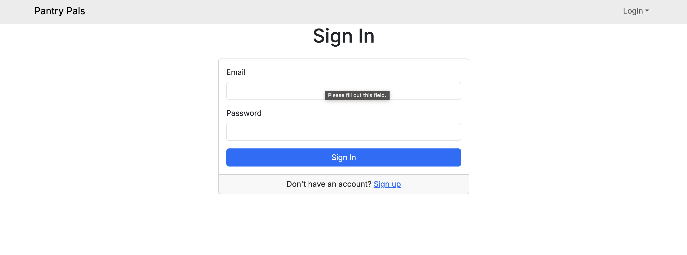
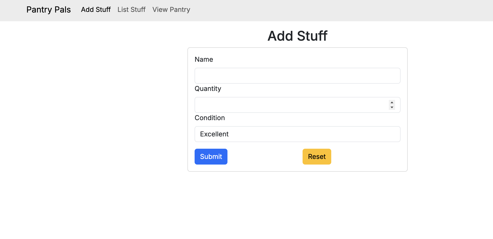
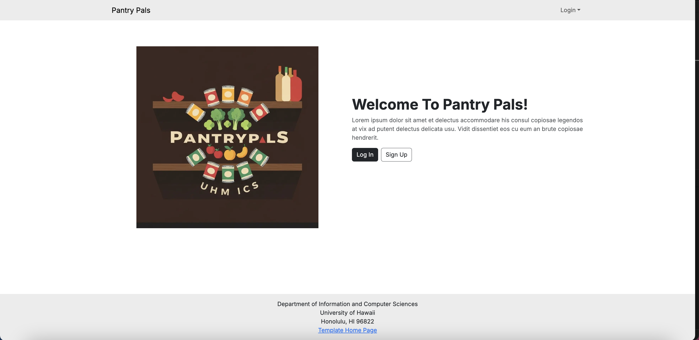
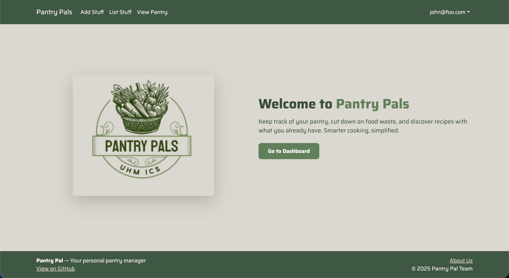
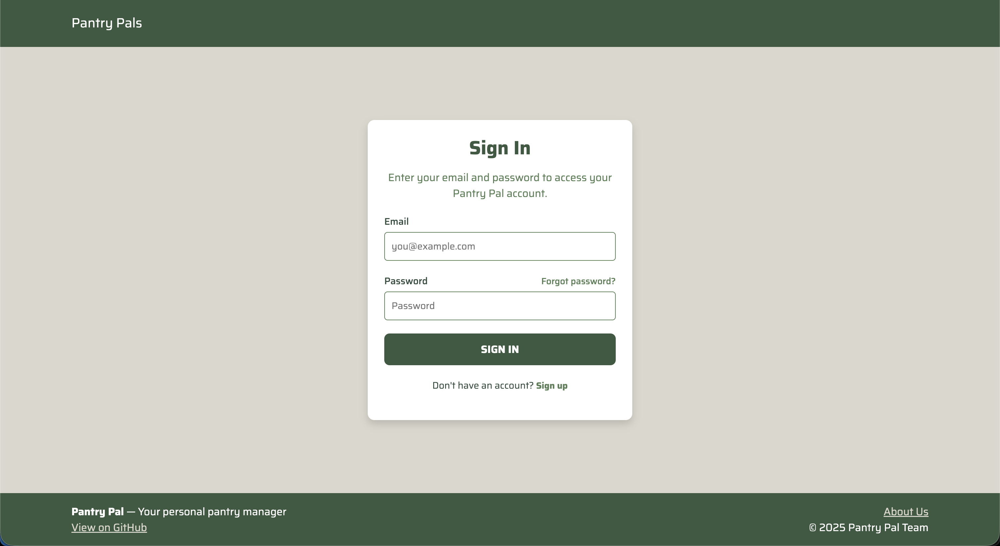
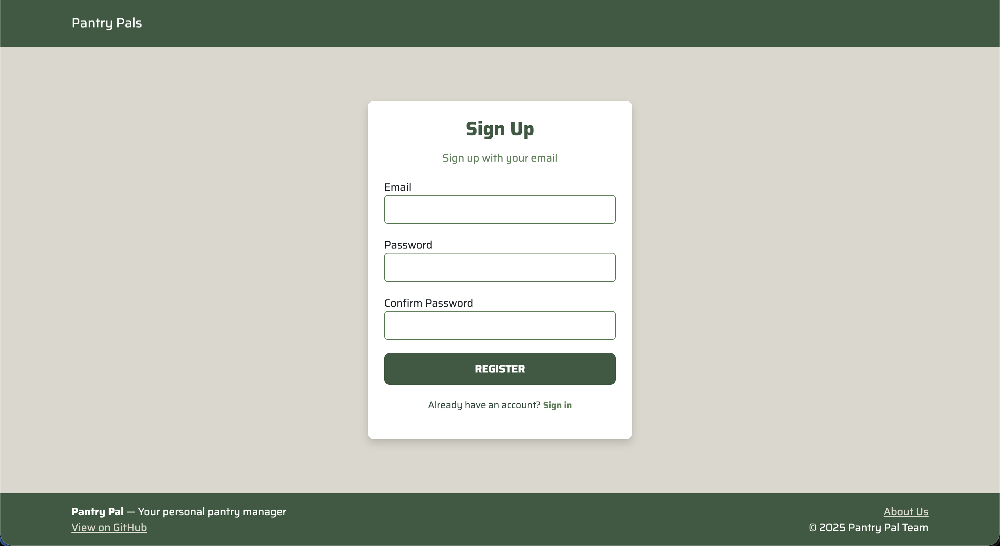
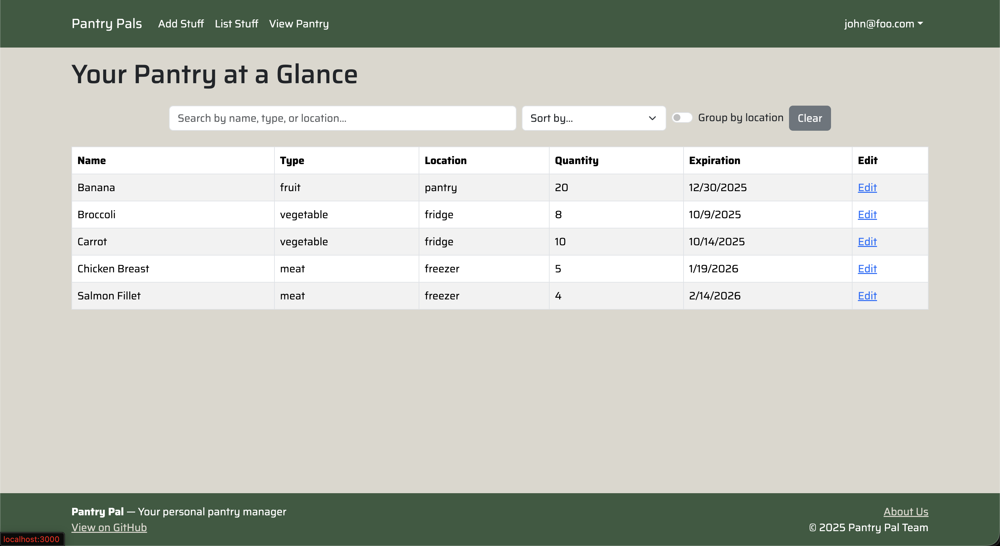
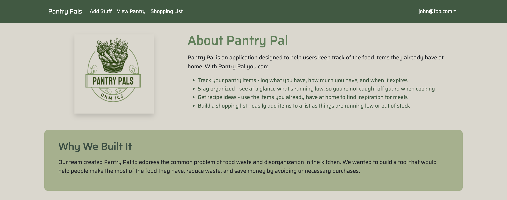
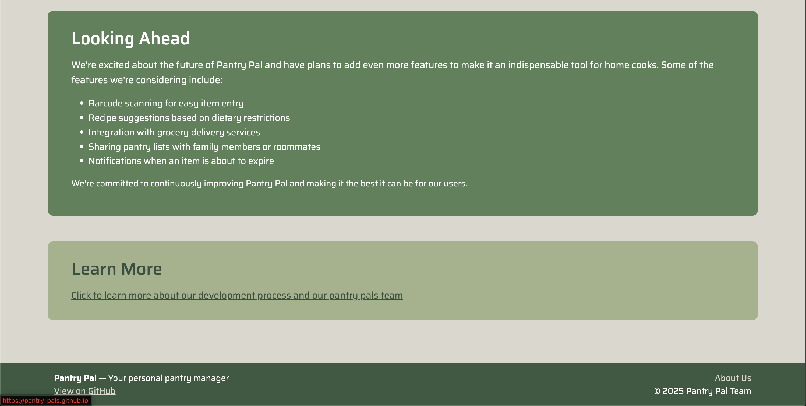

# Pantry Pals

## Table of Contents
1. [Overview](#overview)
2. [Deployment](#deployment)
3. [Team Contract](#team-contract)
4. [User Guide](#user-guide)
5. [Developer Guide](#developer-guide)
6. [Milestone](#milestone)
7. [Milestone 1 Progress](#milestone-1-screenshots-of-progress)
8. [Milestone 2 Progress](#milestone-2-screenshots-of-progress)
9. [Milestone 3 Progress](#milestone-3-screenshots-of-progress)
10. [Continuous Integration](#continuous-integration)
11. [Development Team](#development-team)

<!--
comment out add in later as we progress through project
* [User Guide](#user-guide)
* [Community Feedback](#community-feedback)
* [Developer Guide](#developer-guide)
* [Development History](#development-history)
* [Continuous Integration](#continuous-integration)
* [Walkthrough videos](#walkthrough-videos)
* [Example enhancements](#example-enhancements)
* [Team](#team)
-->

---

## Overview

### Problem
_What's the point of a pantry app?_
- People often forget what they have in their pantry, fridge, or spice rack
- Expired food leads to waste and wasted money 
- Grocery shopping is inefficient without knowing what's already at home

### Approach
- Create a digital inventory system for pantry, fridge, freezer, and spices
- Allow users to easily add, remove, and update items
- Automatically generate shopping lists when items are low or missing
- Simple and clean interface so it's quick to use every day

### Use Case Ideas
- Before going to the store, check what items are low or expired
- While cooking, search the app to see if you have a specific ingredient
- Share the pantry list with family or roomates so everyone is synced
- Use expiration reminders to finish food before it spoils

### Beyond the Basics
- Barcode scanner for quick item entry
- Recipe suggestions based on available ingredients 
- Reports that show spending trends and reduce food waste
- Possible integration with smart home assistance like Alexa or Google Assistant

## Deployment
Pantry Pals is deployed through Vercel, taking advantage of its seamless integration with GitHub and strong support for Next.js applications. The repository’s main branch is connected directly to Vercel, which means that any changes merged into main automatically trigger a new production build. This continuous deployment pipeline ensures that the application is always up to date with the latest code.

During each deployment, Vercel installs the project dependencies, generates the Prisma client, applies any pending database migrations, and then builds the Next.js application for production. Once the build process completes, Vercel publishes the new version of the site, replacing the old one with zero downtime. This automated flow allows the team to focus on development while keeping deployment consistent and reliable.

The live site can be accessed here: [Pantry Pals](https://pantry-pal-gamma.vercel.app)

---

## Team Contract
[Link to Team Contract](https://docs.google.com/document/d/1QSisK4_q7C7179ZbYHU2LISKLjH-Tgl0kmKb8poIX38/edit?usp=sharing)

<!-- PDF.js settings -->
<div id="pdf-viewer" style="
    max-width:900px;
    margin:20px auto;
    border:1px solid #ccc;
    border-radius:8px;
    box-shadow:0 4px 10px rgba(0,0,0,0.1);
    overflow-y:auto;
    height:800px;
    background-color:white;
    padding:10px;
"></div>

<script src="https://cdnjs.cloudflare.com/ajax/libs/pdf.js/3.11.174/pdf.min.js"></script>
<script>
const url = '/assets/team-contract.pdf';
const container = document.getElementById('pdf-viewer');

pdfjsLib.getDocument(url).promise.then(pdf => {
  for (let i = 1; i <= pdf.numPages; i++) {
    pdf.getPage(i).then(page => {
      const scale = 1.5;
      const viewport = page.getViewport({ scale });
      const canvas = document.createElement('canvas');
      const ctx = canvas.getContext('2d');
      canvas.height = viewport.height;
      canvas.width = viewport.width;
      canvas.style.display = 'block';
      canvas.style.margin = '10px auto';
      container.appendChild(canvas);
      page.render({ canvasContext: ctx, viewport: viewport });
    });
  }
});
</script>

---

## User Guide
An intro to using pantry pals  

### Sign in page
Sign up for pantry pals and verify your email to sign in


### Add to your pantry
Keep track of your spices and food by adding them to your pantry  


### View your pantry
Pantry pals allows you to easily keep track of what ingredients you have in your household, where they are, and how much of them you have left


---

## Developer Guide
This section provides information of interest to developers wishing to use this code base as a basis for their own development tasks.

### Installation
First, install [Node.js](https://nodejs.org/en/download/)

Second, visit the [Pantry Pals application github page](https://github.com/pantry-pals/pantry-pal), and click the “Use this template” button to create your own repository initialized with a copy of this application. Alternatively, you can download the sources as a zip file or make a fork of the repo. However you do it, download a copy of the repo to your local computer.

Third, cd into the pantry-pal directory and install libraries with:
```
$ npm install
```

Fourth, run the system with:
```
$ npm run dev
```

If all goes well, the application will appear at [http://localhost:3000](http://localhost:3000).

### Application Design
Pantry Pal is based upon the ICS Software Engineering [Next.js Application Template](https://github.com/ics-software-engineering/nextjs-application-template).

---
## Milestone
* [Milestone 1](https://github.com/orgs/pantry-pals/projects/2)
* [Milestone 2](https://github.com/orgs/pantry-pals/projects/7)
* [Milestone 3](https://github.com/orgs/pantry-pals/projects/10)

## Milestone 1: Screenshots of Progress



## Milestone 2: Screenshots of Progress







## Milestone 3: Screenshots of Progress

---
## Continuous Integration
[](https://github.com/pantry-pals/pantry-pal/actions/workflows/ci.yml)


---
## Development Team
[Justin Smith](https://github.com/justnsmith)  
[James Ivan Cartagena](https://github.com/jicaartagena)  
[Jason Nguyen](https://github.com/jknguyen2003)  
[Haley Teramoto](https://github.com/haleyteramoto)  
[Pelita Felicitas](https://github.com/pelitaf)  
[Jarell Ballesteros](https://github.com/jarellb)  
[Cohen Ruport](https://github.com/cohenruport)  
[Amy Shin](https://github.com/tlsdbfla00)  
[Jared Seto](https://github.com/jseto808)  

